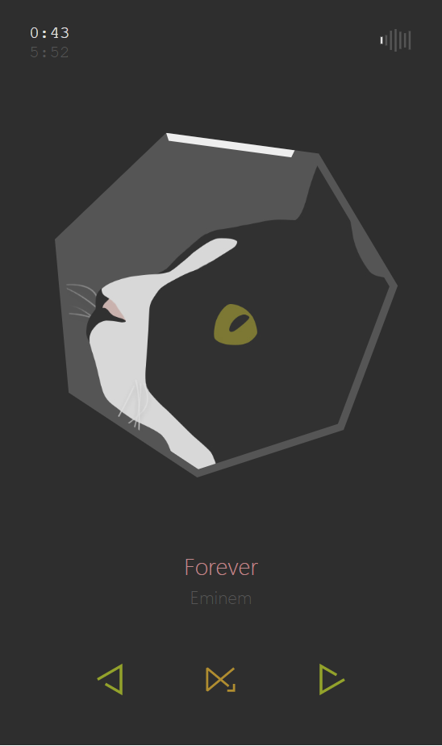

# oreo-plays

This is a front-end project for VLC Web Controller using Vue.js.
All design inspiration came from my cat Oreo (mostly colors)❤️

## screenshot


## Features
- [x] Responsive, consistently pretty on PC/tablet/phone
- [x] Pause, Play
- [x] To next/previous item
- [ ] Volume adjustment
- [ ] Loop mode
- [ ] Album cover

## Usage

#### install
`yarn install`
#### develop
`yarn run serve`
#### build
1. create a file named `custon-config.js` under `/`
2. export the path you'd prefer for emitting the files:
``` js
module.exports = {
  OUTPUT_DIR: '/a/specific/path'
}
```
3. run `yarn run build`

#### use emitted files as the web interface for VLC
see [here](https://www.howtogeek.com/117261/how-to-activate-vlcs-web-interface-control-vlc-from-a-browser-use-any-smartphone-as-a-remote/)
